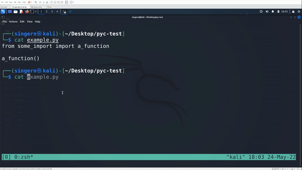

# Ineffective Determinism in Python Bytecode
**[CVSS 5.5]** AV:L/AC:L/PR:N/UI:R/S:U/C:N/I:H/A:N

## Disclosure & Scope
**Author:** Nathaniel Singer (nathaniel@singer.cloud)<br>
**Scope:** Python 3.7.0 - (currently unpatched)<br>
**Disclosure:** 24 May 2022<br>
**Remediation (or Disclosure):** NLT 24 August 2022 

This report will adhere to the industry standard 90 day release policy. The author won't release technical details of this vulnerability for 30 days so long as the vendor patches it prior to the 90-day deadline. The 30-day period is intended for user patch adoption. This policy exists to provide awareness to the public so that those individuals may sufficiently mitigate in order to protect themselves, if they so choose.

## Introduction
 3.7 introduced determinism in it's cached bytecode. This update, proposed in [PEP 552](https://peps.python.org/pep-0552/#frozensets), transitioned from storing a timestamp and size field in the pyc header to a [SipHash](https://en.wikipedia.org/wiki/SipHash), located in their place in the pyc header. At runtime, importlib code checks if the SipHash of the source matches the value stored in the pyc bytecode file header. Unfortunately, the interpreter fails to validate via hash or any other means, that the bytecode represents the original source code it was derived from. This vulnerability offers an attacker the ability to perform instrumentation or injection attacks, resulting in arbitrary requests on behalf of the victim or control of the target via a mechanism such as a reverse shell. While PEP 552 mentions two issues with it's implementation, this specific vulnerability has not yet been discussed in a public forum and as of today effects Python versions 3.7.0 through 3.10.0. These details are expanded on further in the following sections.

## Demonstration (POC) & Impact
In the following proof of concept a malicious python bytecode file is crafted appropriately. It's SimHash is replaced with the original value from the simulated library and then when the library is imported and the function is run, code execution is simulated through execution of the calculator app. Importantly, notice that this code is not visible in the original source.

### Version Capture
```
┌──(singern㉿kali)-[~/Desktop/pyc-test]
└─$ python3 --version               
Python 3.10.4
                                                                                             
┌──(singern㉿kali)-[~/Desktop/pyc-test]
└─$ uname -a     
Linux kali 5.14.0-kali4-amd64 #1 SMP Debian 5.14.16-1kali1 (2021-11-05) x86_64 GNU/Linux
```
### Python PYC Header Comparison
In the following code segments you can find the first 16 bytes of the headers for each associated file. Note that the malicous python bytecode file header matches the SimHash signature in the unchanged original python bytecode. This bytecode is never validated and therefor executes instead of the target source.
```
00000000: 6f0d 0d0a 0000 0000 397f 8d62 2d00 0000  o.......9..b-...
```
*<center>some_import.cpython-310.pyc (Original Unchanged PYC)</center>*
```
00000000: 6f0d 0d0a 0000 0000 7886 8d62 6000 0000  o.......x..b`...
```
*<center>exploit.cpython-310.pyc (Exploit Unchanged PYC)</center>*
```
00000000: 6f0d 0d0a 0000 0000 397f 8d62 2d00 0000  o.......9..b-...
```
*<center>some_import.cpython-310.pyc (Exploit Modified PYC)</center>*
### Exploitation
In the following gif you may observe a demonstration of exploiting this vulnerability. Note that the example.py code and associated library do not include any reference to the malicious injection. The malicious bytecode injected in this case pop a system calculator to demonstrate code execution. A simple python reverse shell or any other payload would work in its place.



The python interpreter does not sufficiently verify that a pyc file represents the target source code, resulting in complete integrity compromise at runtime. This bug allows an attacker to instrument or inject Python bytecode to achieve a malicious goal like extracting user secrets or control by reverse shell.
## Vulnerability Description
Python intends for bytecode to be deterministic by validating that the SipHash of the executed source matches the 5-8 byte value stored in position 8-16 of the pyc header. The following code is responsible for the associated functions. The function documentation is located at:
*<center>https://docs.python.org/3/library/importlib.html#importlib.util.source_hash</center>*

```
752| def _code_to_hash_pyc(code, source_hash, checked=True):
753|    "Produce the data for a hash-based pyc."
754|    data = bytearray(MAGIC_NUMBER)
755|    flags = 0b1 | checked << 1
756|    data.extend(_pack_uint32(flags))
757|    assert len(source_hash) == 8
758|    data.extend(source_hash)
759|    data.extend(marshal.dumps(code))
760|    return data
```
```
705| def _validate_hash_pyc(data, source_hash, name, exc_details):
...       <truncated code comments>
722|    if data[8:16] != source_hash:
723|        raise ImportError(
724|            f'hash in bytecode doesn\'t match hash of source {name!r}',
725|            **exc_details,
726|        )
```
*<center>https://github.com/python/cpython/blob/main/Lib/importlib/_bootstrap_external.py</center>*

Additionally, SipHash is described as fundamentally different from SHA in that it is only suitable as a message authentication code. It should be replaced with a suitable hashing such as SHA. A discussion around the performance hit that this would incur is included in the remediation section of this report.

> Although designed for use as a hash function to ensure security, SipHash is fundamentally different from cryptographic hash functions like SHA in that it is only suitable as a message authentication code: a keyed hash function like HMAC. That is, SHA is designed so that it is difficult for an attacker to find two messages X and Y such that SHA(X) = SHA(Y), even though anyone may compute SHA(X). SipHash instead guarantees that, having seen Xi and SipHash(Xi, k), an attacker who does not know the key k cannot find (any information about) k or SipHash(Y, k) for any message Y ∉ {Xi} which they have not seen before.

*<center>https://en.wikipedia.org/wiki/SipHash</center>*

## Remediation
While hashing does infer a performance hit, if effectively implemented this performance hit is minimal. Much like credentials are verified, both the input and pretext to verify against must be hashed and then the hashes of those values must be compared. In this case, this specifically means that the target source code should be hashed and the python bytecode should be hashed. The hashing algorithm used should be an industry recognized cryptosystem such as the Secure Hash Algorithm (SHA). The ideal recommendation would be something like SHA-256. 

Once these libraries are loaded into memory they will not need to be hashed again as the risk of loading malicious bytecode from the disk is not longer relevant. One strategy for reducing the impact of this import may be to use a Just in Time import strategy or simply import the remaining libs that are not immediately important as clock cycles allow. If Python bytecode is to be advertised as deterministic, it is important that this promise is fulfilled through proper hashing of both the checksum and pretext with an industry recognized algorithm.

Lastly, while there are at least two recognized issues with PEP 552, this issue has not been discussed in a public forum and as such is being responsibly disclosed here. When PEP 552 was accepted, the industry actually recognized some issues and were shocked with the previous standard of non-deterministic time-based verification. It is clear that this is unacceptable and secure python bytecode must be verification must be implemented.

Here is the reddit thread mentioned:
- https://www.reddit.com/r/Python/comments/738998/pep_552_for_deterministic_pyc_files_has_been/

Here are the two articles describing potential problems in PEP 552:
- http://benno.id.au/blog/2013/01/15/python-determinism
- https://bugzilla.opensuse.org/show_bug.cgi?id=1049186
